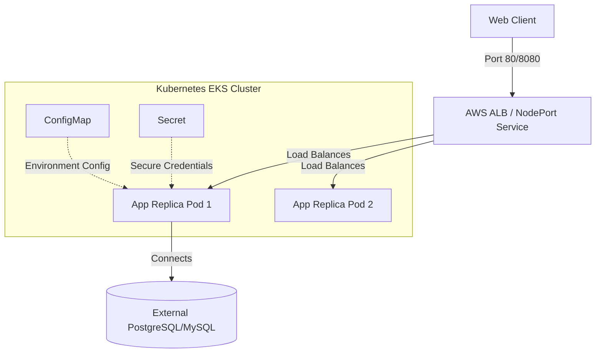
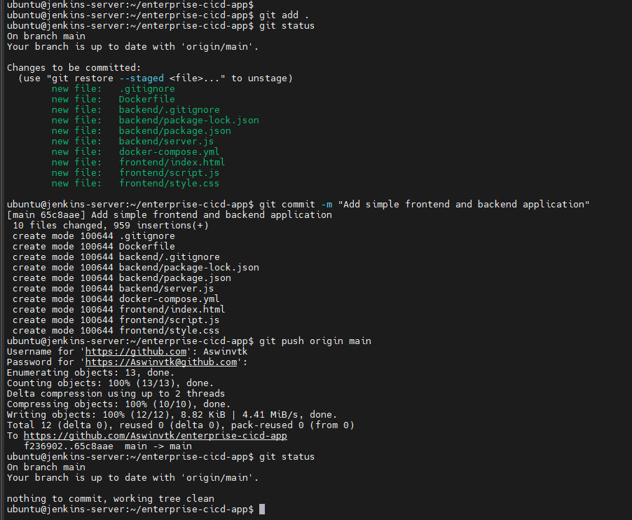
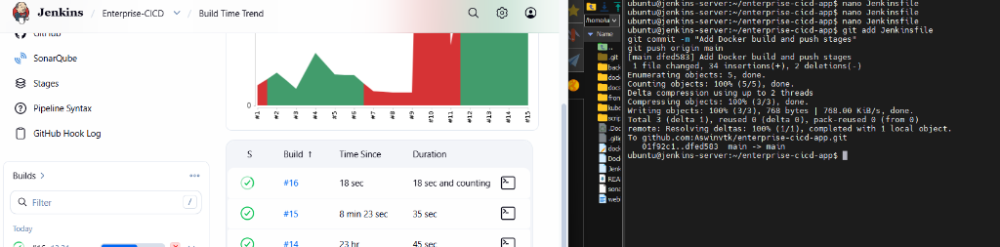
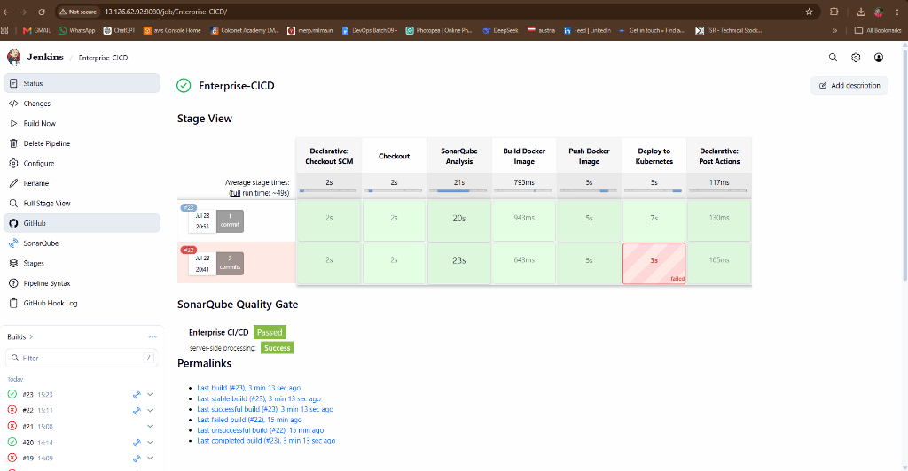

# Enterprise CI/CD Platform for a Three-Tier Web Application

[](LICENSE)
[](docs/Pipeline.md)
[](docs/Pipeline.md)
[](docs/Kubernetes.md)

This repository contains the complete infrastructure, configuration files, and application source code for an **Enterprise CI/CD Platform** designed to deploy a three-tier web application to a Kubernetes (Amazon EKS) cluster. 

The project demonstrates advanced DevOps practices including automated static code analysis, quality gates, containerization, secure credential injection, and zero-downtime rolling updates.

---

## Architecture Overview

The system features a decoupled three-tier web application architecture designed for high availability and security on AWS.



For a detailed breakdown of the network topology, security groups, subnets, and AWS resources utilized, see [Architecture Documentation](docs/Architecture.md).

---

## Technology Stack

- **CI/CD Automation**: Jenkins (Multibranch Declarative Pipeline)
- **Static Code Analysis**: SonarQube (Quality Gates and Scanner tool)
- **Containerization**: Docker (Multi-stage build context)
- **Orchestration**: Kubernetes (Amazon EKS)
- **Local Sandbox**: Docker Compose
- **Runtime Environment**: Node.js, Express, HTML5, CSS3, Vanilla JS

---

## Repository Structure

```text
enterprise-cicd-app/
├── README.md                  # Main project guide
├── LICENSE                    # MIT License
├── .gitignore                 # Version control exclusions
├── Dockerfile                 # Production multi-stage Docker build config
├── Jenkinsfile                # Declarative CI/CD pipeline definition
├── docker-compose.yml         # Local environment orchestration config
├── sonar-project.properties   # SonarQube project analysis rules
├── backend/                   # Node.js backend source code
│   ├── server.js              # Express app entrypoint & /health checks
│   └── package.json           # Dependencies and runtime scripts
├── frontend/                  # Vanilla CSS/JS client codebase
│   ├── index.html             # Client interface
│   ├── style.css              # Custom styling
│   └── script.js              # UI actions & server queries
├── kubernetes/                # Production manifest configurations
│   ├── deployment.yaml        # Deployment specification (2 replicas, rolling updates)
│   ├── service.yaml           # NodePort service configuration
│   ├── configmap.yaml         # Externalized environment variables
│   └── secret.yaml            # Sensitive credentials base
└── docs/                      # Dedicated technical documentation
    ├── Architecture.md        # AWS Network and App Topology details
    ├── Pipeline.md            # Jenkins CI/CD execution pipeline details
    ├── Kubernetes.md          # K8s manifest structure and rollouts
    ├── Deployment.md          # Step-by-step setup guides (local & cloud)
    ├── Troubleshooting.md     # Error codes, logs, and common fixes
    └── Lessons-Learned.md     # Engineering reflections on cost & resources
```

---

## CI/CD Release Pipeline Flow

The Jenkins declarative pipeline automates the release lifecycle:
1. **Checkout**: Automatically retrieves source commits from SCM.
2. **SonarQube Analysis**: Runs static code scanner (`sonar-scanner`) to analyze code quality.
3. **Quality Gate**: Pauses pipeline execution to verify quality scanner conditions. Fails the build if rules are violated.
4. **Docker Build**: Packages backend code using a minimal Alpine container image.
5. **Docker Push**: Pushes the tagged image (`aswinvtk97/enterprise-cicd-app:${BUILD_NUMBER}`) to Docker Hub securely.
6. **Kubernetes Deploy**: Applies manifests to EKS, updates deployment image tags, and checks rollout status (`kubectl rollout status`) to confirm zero-downtime deployment completion.

For more details on pipeline configuration and credentials management, see [Pipeline Documentation](docs/Pipeline.md).

---

## Deployment Instructions

### 1. Running Locally (Quickstart)
Run the application stack locally with Docker Compose:
```bash
docker compose up -d --build
```
- Access the frontend UI at `http://localhost:8080`
- Access the backend API at `http://localhost:3000`

### 2. Deploying to Production Kubernetes
Follow our step-by-step [Deployment Guide](docs/Deployment.md) to set up Jenkins global credentials, install the SonarQube server, register GitHub webhooks, and map target Kubernetes cluster configurations.

---

## Screenshots and Dashboards

Below are the actual screenshots captured during the pipeline execution and server configuration.

### 1. Code Commit & Git Operations
*Terminal log on the Jenkins build runner staging files, checking status, and pushing code releases to the GitHub repository.*


### 2. Jenkins Dashboard & Trends
*The Jenkins controller dashboard showing build trends and pipeline editor terminal.*


### 3. CI/CD Stage Pipeline & Quality Gate Status
*Successful execution of all pipeline stages (Checkout, SonarQube Analysis, Docker Build & Push, Kubernetes Deploy) along with the green 'Passed' SonarQube Quality Gate verification.*


---

## Project Roadmap

- [x] Jenkins Declarative Pipeline Integration
- [x] SonarQube Quality Gates & Static Code Scanner
- [x] Docker Containerization & Hub Publishing
- [x] Kubernetes Namespace, ConfigMap & Secret separation
- [x] Zero-Downtime Rolling Update Strategy
- [ ] Trivy Container Security Vulnerability Scanning
- [ ] Helm Chart packaging for Kubernetes manifests
- [ ] Nginx Ingress Controller deployment for routing mapping
- [ ] ArgoCD GitOps Git-to-Cluster Synchronization
- [ ] Prometheus Resource Metric Monitoring
- [ ] Grafana DevOps Dashboard Visualization

---

## Future Enhancements & Lessons Learned

During active development on AWS, the cluster was shut down due to resource limitations (CPU/Memory overhead on EKS control planes) and cloud billing limits. This taught valuable lessons in cluster resource limits and instance sizing:
- **Resource Constraints**: Realized the critical importance of defining strict container resource limits (`requests` and `limits`) to avoid node starvation.
- **Monitoring Cost**: Spot instances and node auto-scaling are essential when running pipelines with heavy static-analysis servers.

Read more structural lessons in [Lessons Learned Documentation](docs/Lessons-Learned.md).
