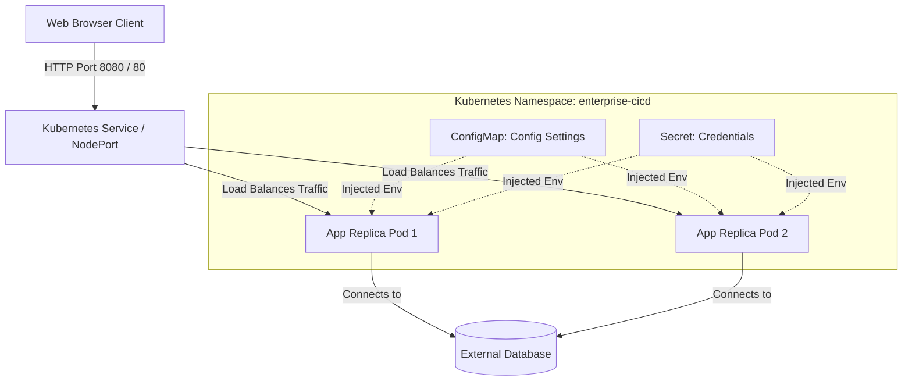
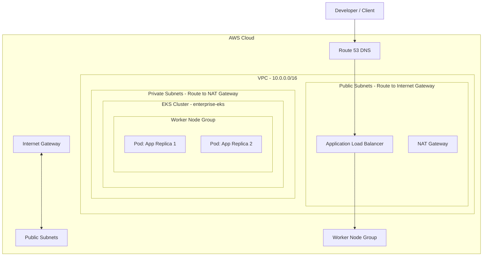

# System Architecture

This document describes the high-level architecture of the Enterprise Web Application and its supporting AWS cloud infrastructure.

## Application Architecture

The application is structured as a professional three-tier web application designed for high availability, fault tolerance, and security.

### Components
1. **Frontend**: Static client interface utilizing HTML5, CSS3, and JavaScript. It communicates with the backend via RESTful APIs.
2. **Backend**: Node.js and Express server that processes business logic, handles API routing, exposes container health status under `/health`, and interacts with database resources.
3. **Configurations & Secrets**: Externalized from application code using Kubernetes `ConfigMap` and `Secret` resources to comply with GitOps guidelines and the Twelve-Factor App methodology.

---

## AWS Infrastructure Architecture

When deployed in production, the application runs on a scalable Kubernetes cluster managed by Amazon EKS (Elastic Kubernetes Service).

### Network Topology
- **VPC (Virtual Private Cloud)**: Segmented into multiple Subnets across at least two Availability Zones (AZs) to assure high availability.
- **Public Subnets**: Houses the AWS Application Load Balancer (ALB) and NAT Gateways. These subnets have routes mapped directly to the Internet Gateway.
- **Private Subnets**: Houses the Amazon EKS Worker Node Groups. They do not have direct ingress from the public internet. Outgoing connections (e.g., pulling Docker images or hitting external APIs) route through the public NAT Gateways.

### Security Configurations
- **Security Groups**: Strict security groups limit communication. The Application Load Balancer only accepts inbound traffic on HTTP (80) and HTTPS (443), while the worker nodes only accept inbound traffic from the ALB security group.
- **IAM Roles for Service Accounts (IRSA)**: Integrates EKS pods with AWS IAM, allowing pods to authenticate to AWS resources (like databases or S3) securely without baking static credentials into the container.
