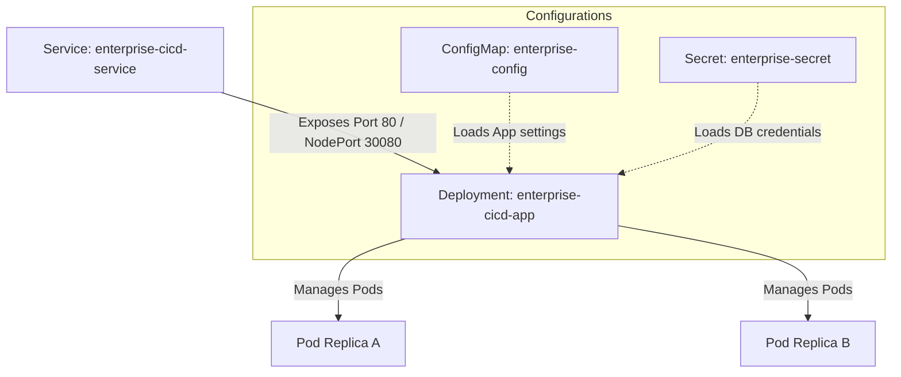

# Kubernetes Manifests and Deployment Strategy

This document details the Kubernetes resource definitions and deployment patterns configured in this repository.

## Manifest Overview

All Kubernetes resources are located in the `kubernetes/` folder. They define the deployment structure for the enterprise application within its dedicated namespace `enterprise-cicd`.



---

## Detailed Resource Descriptions

### 1. Namespace (`namespace` implicitly referenced in metadata)
- **Namespace**: `enterprise-cicd`
- **Purpose**: Creates logical partition isolation on the Kubernetes cluster, segregating resources from default system operations and other environments (like staging or development).

### 2. Deployment (`deployment.yaml`)
Manages the application lifecycle, scaling, and rolling replacement strategy.
- **Replicas**: 2 active pods to ensure high-availability and redundancy.
- **Resource Constraints**:
  - **CPU (Request: 100m, Limit: 500m)**: Allocates sufficient scheduling share but limits computational runaways to prevent noisy-neighbor effects on worker nodes.
  - **Memory (Request: 128Mi, Limit: 512Mi)**: Prevents leaks from exhausting node capacity. Pods exceeding the limit are terminated via Out-Of-Memory (OOM) eviction.
- **Probes**:
  - **Readiness Probe**: Queries `/health` on port `3000` with a 10s initial delay. Traffic is routed to the pod only after it passes.
  - **Liveness Probe**: Queries `/health` on port `3000` with a 20s initial delay. If the application freezes or deadlocks, Kubernetes kills and automatically recreates the pod.

### 3. Service (`service.yaml`)
Acts as a internal load-balancer mapping web traffic to active pods.
- **Type**: `NodePort`
- **Port Mapping**:
  - Cluster Port: `80` (Internal port of the Service)
  - Target Port: `3000` (Internal port of the Application Container)
  - NodePort: `30080` (Direct access port on any Node IP)

### 4. ConfigMap (`configmap.yaml`)
Stores environment-specific, non-sensitive configurations.
- **Keys**: `APP_NAME`, `APP_ENV`, and `COMPANY_NAME`.
- **Injection**: Mounted dynamically into container runtime environment variables.

### 5. Secret (`secret.yaml`)
Stores encrypted-at-rest credential pairs.
- **Keys**: `DB_USERNAME`, `DB_PASSWORD`, `JWT_SECRET`.
- **Warning**: Placed in Git for baseline reference. Production strategies require SealedSecrets or external volume mounts from AWS Secrets Manager.

---

## Deployment Strategy: Rolling Update

The deployment applies a zero-downtime rolling update strategy to replace old container versions with new releases.

```text
Desired Replicas: 2 | maxSurge: 1 | maxUnavailable: 1

Step 1: Deploy New Replica Pod 3 (Surge to 3 Pods: 2 old, 1 new)
Step 2: Wait for Pod 3 to pass Readiness Probe
Step 3: Terminate Old Replica Pod 1 (Down to 2 Pods: 1 old, 1 new)
Step 4: Deploy New Replica Pod 4 (Surge to 3 Pods: 1 old, 2 new)
Step 5: Wait for Pod 4 to pass Readiness Probe
Step 6: Terminate Old Replica Pod 2 (Down to 2 Pods: 2 new)
Rolling Update Complete!
```

This guarantees that at least one pod is online and ready to accept client connections throughout the transition.
