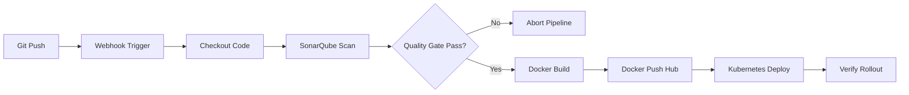

# CI/CD Pipeline Documentation

This document explains the design, stages, and integration points of the Jenkins CI/CD release pipeline.

## Pipeline Overview

The CI/CD pipeline automates the integration and delivery pipeline, checking out code, enforcing static analysis checks, packaging the runtime environment, and shipping the app to Kubernetes safely.

---

## Stage Breakdown

### 1. Checkout
- **Action**: Dynamically fetches the current git branch context using the Jenkins SCM integration.
- **Goal**: Guarantees that the pipeline is executing against the exact commit that triggered the build.

### 2. SonarQube Analysis
- **Action**: Launches the `sonar-scanner` CLI within the build agent environment.
- **Configuration**: Uses configuration metadata from the `sonar-project.properties` file in the root workspace directory.
- **Details**:
  - Scans JavaScript/Node.js files for syntax errors, potential security vulnerabilities (SQL injections, XSS), and code smells (duplicated code, cognitive complexity).
  - Connects securely to the centralized SonarQube Server.

### 3. Quality Gate
- **Action**: Suspends execution and polls the SonarQube server waiting for analysis verification.
- **Behavior**: If the code violates rules (e.g., security hotspots present, code coverage below 80%), the quality gate returns a `FAILED` status, automatically terminating the build to protect downstream environments.
- **Timeout**: Enforces a strict 5-minute timeout window to prevent Jenkins executor threads from hanging.

### 4. Build Docker Image
- **Action**: Invokes `docker build` using the root level `Dockerfile`.
- **Naming Convention**: Tags the generated image with the format: `${IMAGE_NAME}:${BUILD_NUMBER}`.
- **Best Practices**: The container build uses a cached multi-stage setup based on a minimal Node.js alpine base image to optimize image layer footprint.

### 5. Push Docker Image
- **Action**: Authenticates against the Docker Hub registry and uploads the built image layer.
- **Security**: Uses Jenkins secure credentials store, injecting username and password variables dynamically without exposing credentials in console outputs.

### 6. Deploy to Kubernetes
- **Action**: Executes a series of shell commands using `kubectl` targeting the Amazon EKS cluster.
- **Deployment Process**:
  1. Applies manifests (`configmap.yaml`, `secret.yaml`, `service.yaml`, `deployment.yaml`).
  2. Runs `kubectl set image` to update the active template container tag to match the current build tag (`${IMAGE_TAG}`).
  3. Executes `kubectl rollout status` to monitor container replacement and verify that new replica sets spin up and pass health probes before completing the build.
